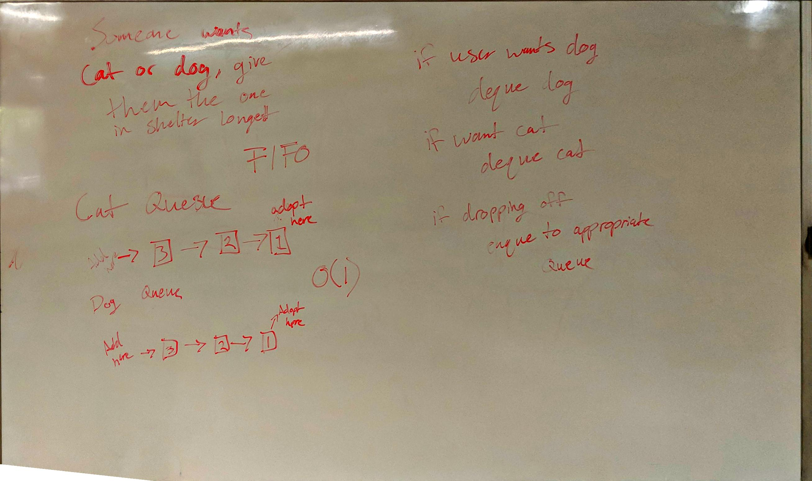

# Challenge Summary
Create an animal shelter where the animal that has been waiting the longest is the first to be donated.

## Challenge Description
For this challenge, we are creating an animal shelter that accepts cats and dogs. Animal adopters can specify if they
 want a cat, a dog, or have no preference. Then, we must give them the matching animal that has been in the shelter 
 the longest.  

## Approach & Efficiency
For this challenge I went for a straightforward approach using a pair of queues.

For donating an animal, I simply detect it's species and add it to the appropriate queue. This has an efficiency of O
(1).

For adopting an animal, I go to the queue of the type specified and dequeue the first animal that had been added to 
the list. 

## Solution

[Link to Code](../code401Challenges/src/main/java/fifoAnimalShelter/AnimalShelter.java)

[Link to Tests](../code401Challenges/src/test/java/fifoAnimalShelter/AnimalShelterTest.java)

