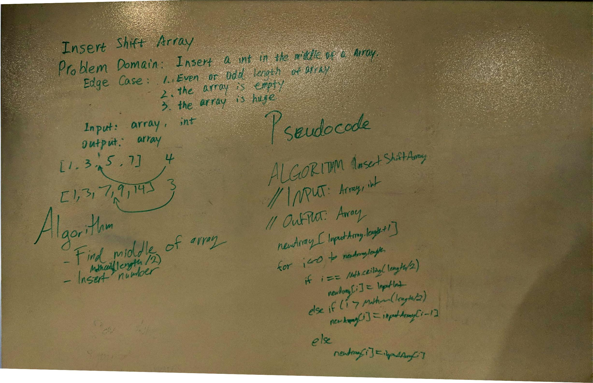

# ArrayShift Challenge
This challenge is to manually insert a number into the middle of an array. 

## Description
The trick to inserting a number in the middle of an array is to define the "middle." For even-element arrays, this is easy. For odd-element arrays, it was a bit trickier. 

## Approach
To tackle the problem of odd-length arrays, once we determined that it was odd we had to add 1 to the result of length/2. This is because dividing ints in Java returns an int, and thus will automatically be rounded down. 

Tools like Math.ceil will not work unless you cast the ints to doubles, which is not advised since doubles can be inaccurate with division. So, we stuck with the simpler approach of manually checking and adding 1 to the halfway number on odd-length arrays. 

## Solution

[Link to code](../code401challenges/src/main/java/code401challenges/ArrayShift.java)

[Link to tests](../code401challenges/src/test/java/code401challenges/ArrayShiftTest.java)

