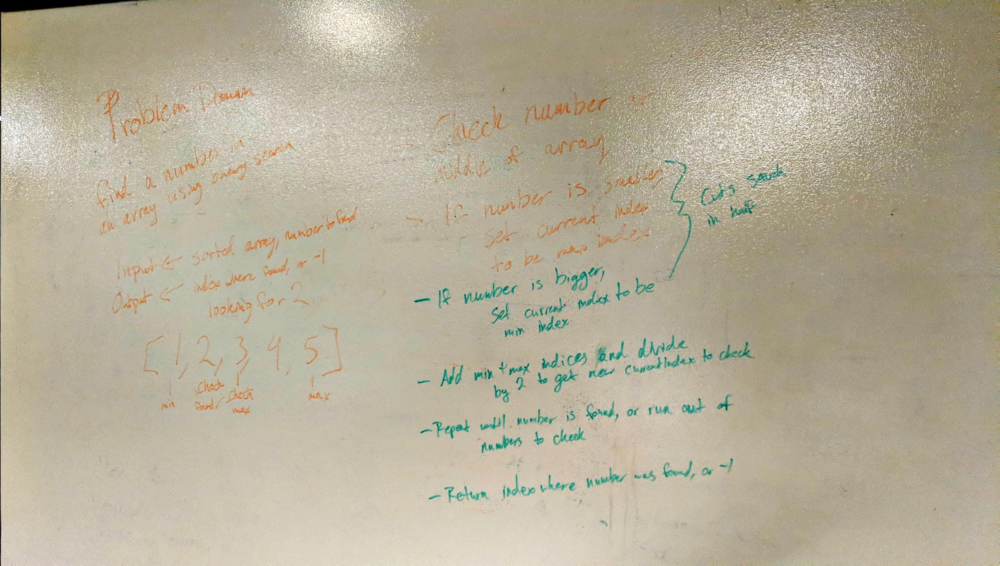

# Binary Search Challenge

Find a number in a sorted array using binary search. 

## Description

To efficiently find a number in an array, we were tasked with implementing a binary search. This effectively cut the problem set in half with each check for the number we were seeking. 

## Approach

To implement binary search, I set values for the maximum and minimum index values, then checked the number halfway between the two. 

If the number I was looking for was bigger than the number at the current index, I would set the minimum index to the current index. If the number I'm looking for is smaller, I would move the maximum index to the current index. 

From there, I would repeat the process until either the number was found, or I ran out of numbers to check.

## Solution

[Link to Code](../code401challenges/src/main/java/code401challenges/BinarySearch.java)

[Link to Tests](../code401challenges/src/test/java/code401challenges/BinarySearchTest.java)

