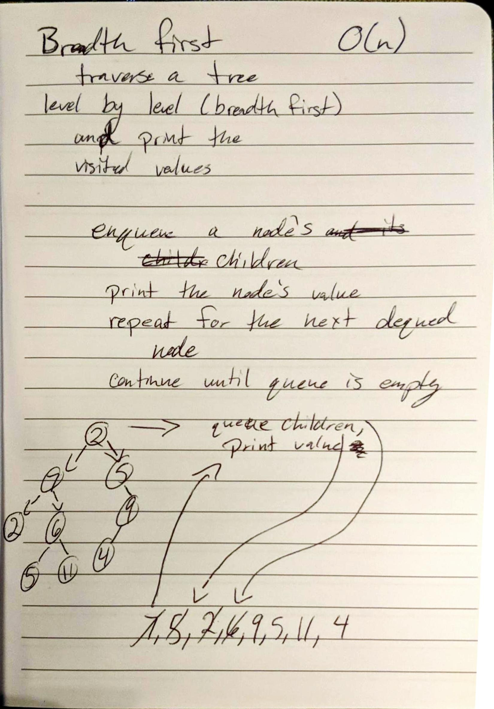

# Breadth First Traversal - Trees

Traverse a tree level by level. In other words, build a breadth traversal.

## Description

For this challenge, we had to traverse a tree by its breadth rather then its depth. This meant travelling through the
 node level by level rather than chasing one string of children at a time. 

## Approach

To traverse my tree for this method, I used a queue. (Credit goes to our teacher Michelle for the suggestion.) This 
was the easiest, and most efficient solution to our problem because it naturally handled our nodes in the desired 
FIFO order. Each level had to be cleared before we could process the children. 

## Efficiency

No new space is allotted since we are traversing the original tree. 

Time is dependent on the size of the tree, so it's O(n).

## Solution

[Link to Code](../code401Challenges/src/main/java/tree/BinaryTree.java)

[Link to Tests](../code401Challenges/src/main/java/tree/BinaryTree.java)

