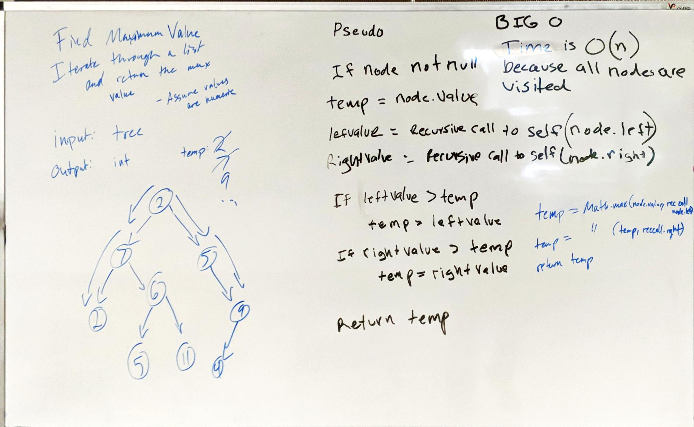

# Find Maximum Value - Trees

Return the maximum value contained in a tree. 

## Description

For this challenge, our goal was to return the largest value in a tree. 

## Approach

To accomplish this, I visited every node in the tree and compared it against a temp value to see which was bigger. 

If the other value was bigger, it becomes the new temp. 

Once all nodes had been visited, I returned the temp value.  

## Efficiency

Time: O(n)

Space: O(1)

## Solution

[Link to Code](../code401Challenges/src/main/java/tree/BinaryTree.java)

[Link to Tests](../code401Challenges/src/main/java/tree/BinaryTree.java)

