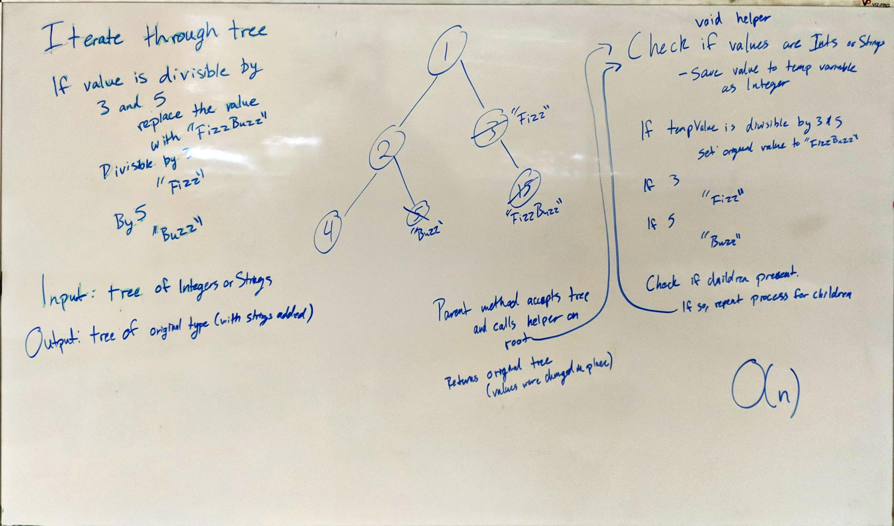

# FizzBuzz Tree

Change values in a tree to "Fizzbuzz", "Fizz", or "Buzz" depending on the original value.

## Description

For this challenge, if the value of a tree node is divisible by 3 and 5, we are to change that value to "FizzBuzz." 

If it is only divisible by 3 we change it to "Fizz", and likewise for 5 and "Buzz." 

If none of the above, we leave the value alone. 

We then return the tree with the new values.

## Approach

For this challenge, I chose to use a parent method and a recursive helper method. 

The parent method takes in the tree and calls the helper method on the root node. 

The helper then checks if the value is of type Integer or String, and then saves that value to a temporary Integer 
variable. 

Then we do the modulus math and assign the values accordingly. 

Once that is done, we check if the node has any children and call the helper on those children to repeat the process 
until no more nodes remain. 

## Efficiency

No new space is allotted since we are directly modifying the original tree. 

As for time, this is dependent on the size of the tree, so it's a straightforward O(n).

## Solution

[Link to Code](../code401Challenges/src/main/java/fizzBuzzTree/FizzBuzzTree.java)

[Link to Tests](../code401Challenges/src/main/java/fizzBuzzTree/FizzBuzzTree.java)

