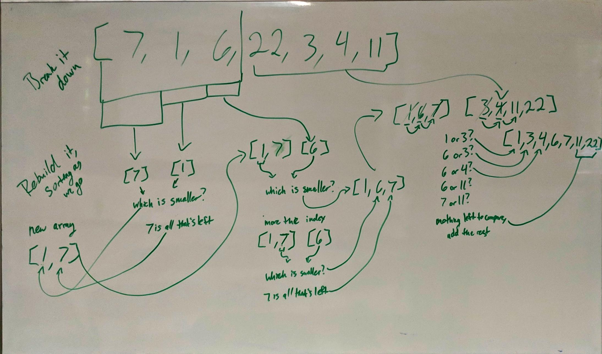

# Lecture Notes: Merge Sort

Merge sort breaks an array down into sub arrays, and then recombines them, sorting as we go.  

With this approach, we only "move" the element once as we put it into the final array, so it is far more efficient 
than insertion sort which potentially has to move an element multiple times. 

## Learning Objectives

- Understand what the Merge Sort algorithm is.
- Understand the theory behind Merge Sort.
- Be able to implement Merge Sort in code.  

## Lecture Flow

- Draw out a visual of Merge Sort 
    - First breaking the array down.
    - Then recombining elements in the correct order.
- Go into more detail with pseudo code
    - Initial method to break down the arrays.
    - Helper method to recombine the arrays in the correct order.
    - Spend time explaining how recursion makes this possible. 

## Diagram

## Algorithm

1) First, break down the array into sub arrays.
    divide them in half until you have two arrays with only one item each. 
    
2) Then, recombine the arrays, putting in the smallest element from each array first. 

3) Repeat with the next sub array until we are left with one sorted array. 
    
   * Now that we have more elements in these arrays, we start by looking at the first element in each array since we 
    know those will be the smallest. 
    
   * Once an element is added to the new array, we advance the index in the subarray to the next element. 
    
   * Repeat until we reach the end of one of the array, then add the remaining elements from the other array. 
     

## Pseudocode

(Taken from the Codefellows assignment)

    ALGORITHM Mergesort(arr)
        DECLARE n <-- arr.length
               
        if arr.length > 1
          DECLARE mid <-- n/2
          DECLARE b <-- arr[0...mid]
          DECLARE c <-- arr[mid...n]
          // break down the left side
          Mergesort(b)
          // break down the right side
          Mergesort(c)
          // merge the left and the right side together
          Merge(b, c, arr)
    
    ALGORITHM Merge(b, c, a)
        DECLARE i <-- 0
        DECLARE j <-- 0
        DECLARE k <-- 0
    
        while i < b && j < c
            if b[i] <= c[j]
                a[k] <-- b[i]
                i <-- i + 1
            else
                a[k] = c[j]
                j <-- j + 1
                
            k <-- k + 1
    
        if i = b.length
           add remaining items in array c to array a
        else
           add remaining items in array b to array a
           
        return a

## Readings and References

Read [this breakdown from HackerEarth](https://www.hackerearth.com/practice/algorithms/sorting/merge-sort/tutorial/)

If you are a more visual learner, you can watch [this video from Harvard's CS50](https://youtu.be/Pr2Jf83_kG0?t=15)

You can also use [this study guide from Harvard](https://study.cs50.net/merge_sort) as a quick reference.

 