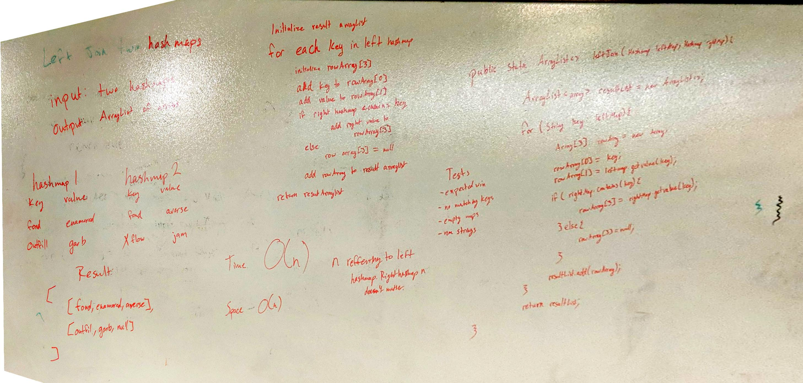

# Left Join Hashmaps

Perform a [left join](https://www.tutorialspoint.com/sql/sql-left-joins.htm) on two hash maps. 

## Description

We were tasked with taking in two hashmaps and manually performing a left join. 

This means that every key in the left map will be present in the result list, and they will grab matching results 
from the right map and append them to their array. (We will be returning an ArrayList of arrays). If there is no 
matching value, null will be appended instead. 

## Approach

I go through each key in the left map and add them to a rowArray, with the key at index 0 and the value at index 1. 

Then, if the right map has a matching key I add its value to index 3. Otherwise, index 3 is null. 

Then I add that array to our list, repeat for the next key, and return the resulting list. 

## Efficiency

Time: O(n)

Space: O(n)

## Solution

[Link to Code](../code401Challenges/src/main/java/leftJoin/LeftJoin.java)

[Link to Tests](../code401Challenges/src/test/java/leftJoin/LeftJoinTest.java)

