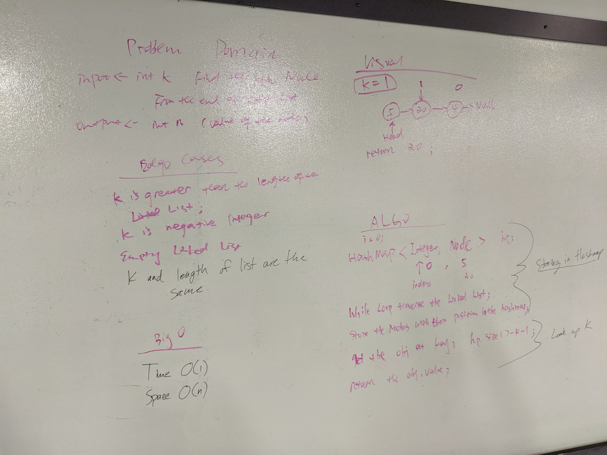

 # Linked List Backwards
 
 Finding a node based on its position relative to the end of the list.

## Description

For this challenge, the goal was to grab the value from a node this is k positions away from the end of the list. (Count starts at 0.)

## Approach

The approach we implemented was to store the LinkedList in a HashMap for easier lookup, and then grab the value at HashMap.size - k - 1

## Efficiency

O(n) - as the list gets larger, work will increase in constant time. 

## Solution 

[Link to Code](../code401challenges/src/main/java/linkedList/LinkedList.java)

[Link to Tests](../code401challenges/src/test/java/linkedList/LinkedListTest.java)

