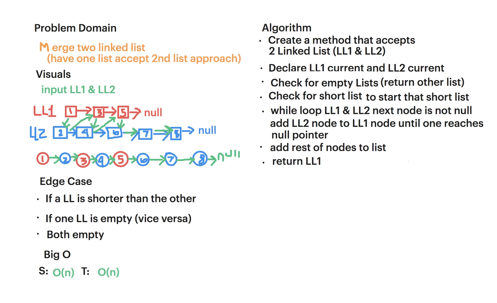

 # Linked Lists Merge

 Merging two linked lists without creating a new list. 

 ## Description

 In a continuation of our adventures with linked lists, our new task is to merge two linked lists. 
 
 And no being lazy, we aren't allowed to simply create new nodes and copy everything over. We must use our Node resources wisely. 

 ## Approach

 For our approach, we are going to simply reassign our pointers to get the nodes in the two lists to point to each other rather than pointing to their original list nodes. 

 ## Efficiency

 O(n) for time

 O(1) for space since we won't be utilizing any more memory than what was originally handed to us. 

 ## Solution

 [Link to Code](../code401challenges/src/main/java/linkedList/LinkedList.java)

[Link to Tests](../code401challenges/src/test/java/linkedList/LinkedListTest.java)

