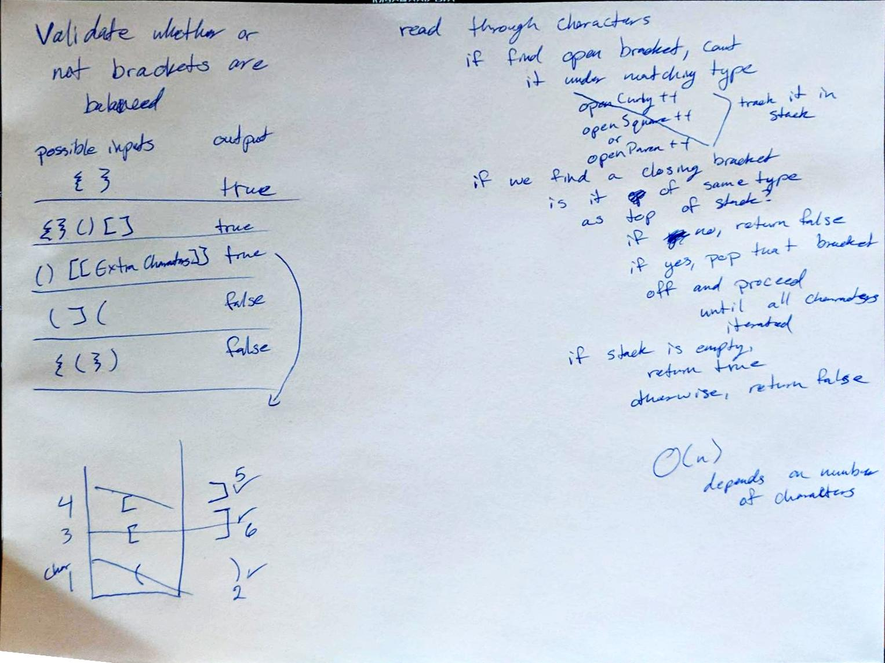

# Challenge Summary
Check that brackets in a string are balanced.

## Challenge Description
For this challenge, we wanted to check if the brackets in a string are balanced. For example: 

    Input	Output
    {}	  TRUE
    ___
    {}(){}	  TRUE
    ___
    ()[[Extra Characters]]	TRUE
    ___
    (){}[[]]    TRUE
    ___
    {}{Code}[Fellows](())	TRUE
    ___
    [({}]	FALSE
    ___
    (](	FALSE
    ___
    {(})	FALSE

## Approach & Efficiency

To check if the brackets are balanced, I went through each character in the string. If it was an opening bracket, I 
stored it in a stack. 

If it was a closing bracket, I compared it to the value at the top of the stack. If the brackets did not match, we 
know the brackets are unbalanced and we return false. 

If the brackets match, I will pop the opening bracket off the stack and we will continue. 

This process ignores any character that is not a bracket.

Once we have finished iterating through the characters, we check if the stack is empty. If it is, we know that all 
brackets have been matched and return true. If it's not empty, then we know that some unlucky bracket didn't find a 
friend and return false.  

The efficiency for this solution is O(n) since it is dependent on the length of the String.

## Solution

[Link to Code](../code401Challenges/src/main/java/multiBracketValidation/MultiBracketValidation.java)

[Link to Tests](../code401Challenges/src/test/java/multiBracketValidation/MultiBracketValidationTest.java)

