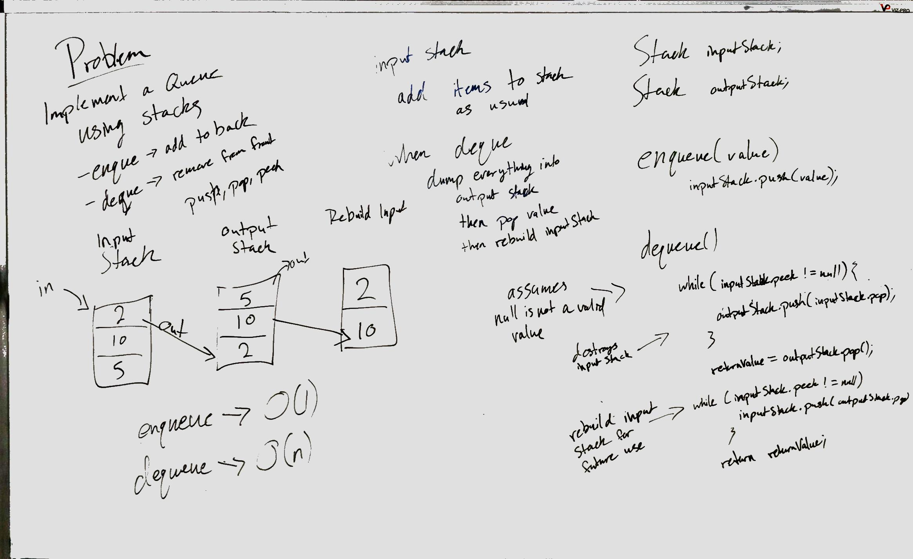

# Challenge Summary
Create a Queue using two Stacks

## Challenge Description
For this challenge, we were expected to create a Queue with standard enqueue/dequeue functionality using Stacks as 
our only instance variables. 

## Approach & Efficiency
For this challenge I went for a straightforward approach using an inputStack and an outputStack. 

For enqueue, I simply pushed the new value onto the input stack. 
This has an efficiency of O(1).

For dequeue, I dumped the inputStack into the outputStack, effectively flipping it over, then I popped the last value
 off. I then rebuilt the inputStack by pushing the remaining outputStack values back into it.
 This function has an efficiency of O(n).

## Solution

[Link to Code](../code401Challenges/src/main/java/queueWithStacks/PseudoQueue.java)

[Link to Tests](../code401Challenges/src/test/java/queueWithStacks/PseudoQueueTest.java)

