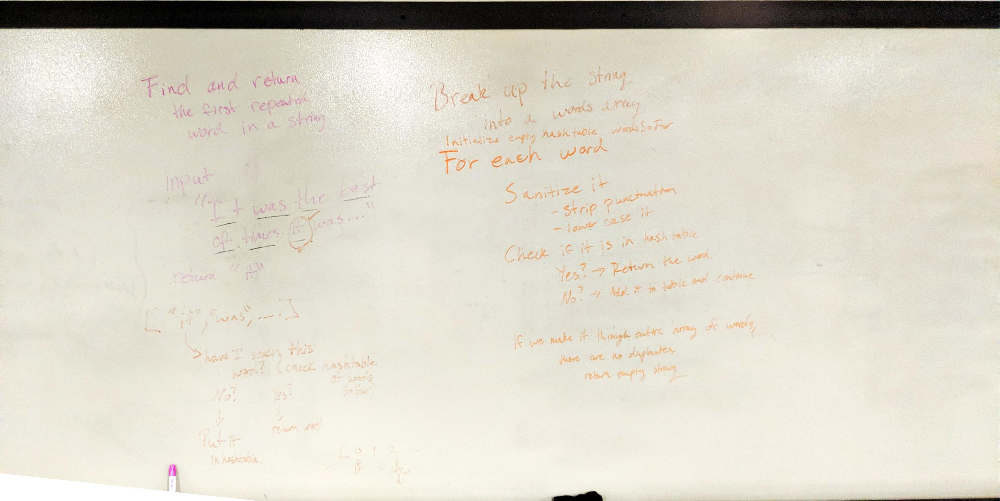

# Find the Repeated Word

Find and return the first repeated word in a string.

## Description

Our task: given a String, find the first repeated word and return it. 

For example: 

    input: "It was the best of times, it was the worst of times,..."
    
    return: "it"

## Approach

To find the repeated word, I first split the string into an array of words. 

Then, for each word in the array I sanitize it (remove punctuation and lowercase it), then I check to see if it is in
 a hashtable called wordsSoFar. 
 
 If it's not in the table, I add it and move on to the next word. 
 
 If it is in the table, I return the word. 
 
 If I make it through the entire array without finding a duplicate, then I return an empty string. 

## Efficiency

Time: O(n)

Space: O(n)

## Solution

[Link to Code](../code401Challenges/src/main/java/repeatedWord/RepeatedWord.java)

[Link to Tests](../code401Challenges/src/main/java/repeatedWord/RepeatedWord.java)

