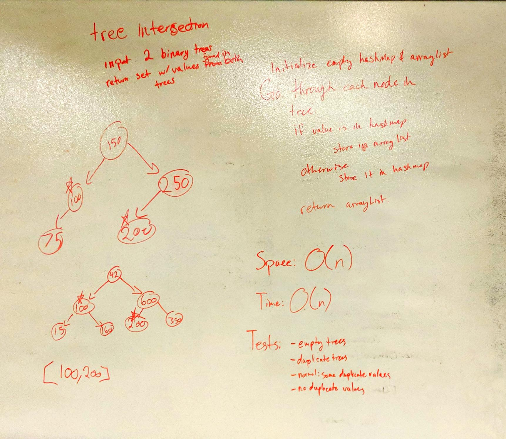

# Tree Intersection

Compare two trees and return a list of all values found in both trees

## Description

In this challenge, we are given two trees and must compare them and return a list of all values found in both lists. 

## Approach

First, I store all the values from the first tree into a set. Ideally, I would want to store them in a hashset, but 
since I am using a previously built BinaryTree function that returns a list, I will be using that instead. 

Then, I iterate through each node in the second tree and compare it to the list of first tree values. If it's in that
 list, I add it to our result list, if not, I proceed to the next node until there are no more nodes. 
 
At the end of the day, return the result list. If no matches were found, the list will be empty.

## Efficiency

Time: O(n)

Space: O(n)

## Solution

[Link to Code](../code401Challenges/src/main/java/treeIntersection/TreeIntersection.java)

[Link to Tests](../code401Challenges/src/main/java/treeIntersection/TreeIntersection.java)

